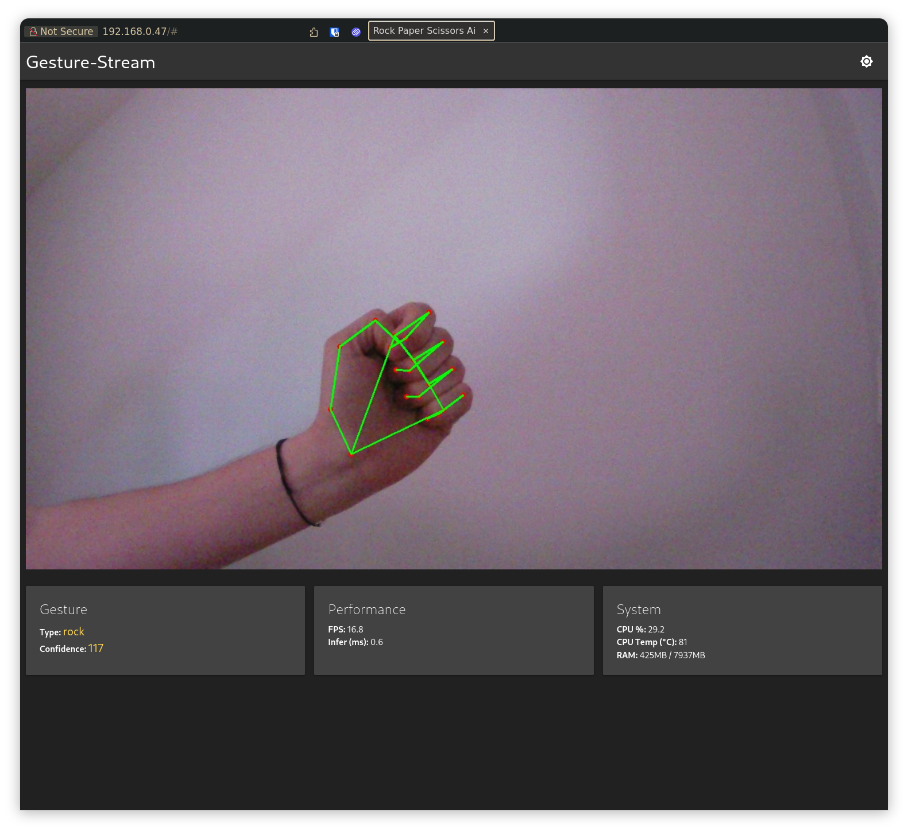

<p align="center">
 <a href="https://github.com/dav354/seminar/actions">
    
  </a>
  <br/>
  <br/>
  
</p>

# Schnick Schnack Schnuck Pepper

## Schitt 0
- thema definieren
- api pepper anschauen
- ai vision modell finden (gesten)
- python pepper bibliothek

## Schritt 1 (prototyp)
- Kamera
- Pi mit Coral TPU
- Gestenerkennung der Hand
- Schnick Schack Schnuck business logik

## Schritt 2
- mit pepper zum laufen bekommen
- compute immer noch auf pi & coral tpu
- pepper kameras nutzen
- pepper und pi via wifi verbinden

## Todo



- [x] gesture recognition
- [x] video stream
- [x] webui
- [o] other/custom model for rock, paper, scissors
- [ ] game logic

## Venv

```shell
python3.10 -m venv .venv
source .venv/bin/activate
pip install --upgrade pip
pip install -r requirements.txt
```

## Prerequisites
- install python 3.10

https://coral.ai/docs/edgetpu/compiler/

https://coral.ai/docs/accelerator/get-started/#install-the-edge-tpu-runtime

## Install edge tpu repo

```shell
echo "deb https://packages.cloud.google.com/apt coral-edgetpu-stable main" | sudo tee /etc/apt/sources.list.d/coral-edgetpu.list
curl https://packages.cloud.google.com/apt/doc/apt-key.gpg | sudo apt-key add -
sudo apt update
sudo apt install edgetpu-compiler
```

## Pi installation with ansible

To setup the pi there is a small ansbile script. To run it you need to install ansible.

> [!NOTE]
> This step assumes you installed ubuntu24.04

1. First install the required galaxy roles:
  
  ```shell
  ansible-galaxy install geerlingguy.docker
  ```

2. Now you can execute the the playbooK:

  ```shell
  ansible-playbook -i '192.168.0.189,' -u david setup_pi.yml -Kk --diff
  ```

## Docker context

to use docker on the pi create a new docker context

```shell
docker context create pi \
  --docker "host=ssh://david@192.168.0.47"
```

then to use it

```shell
# See all your contexts
docker context ls

# Switch to the Pi
docker context use pi
```

to switch back

```shell
docker context use default
```

## Manual Build

to build the docker image locally run:

```shell
docker buildx create --name multiarch-builder --driver docker-container --use
docker buildx build \
  --builder multiarch-builder \
  --platform linux/arm64 \
  --load \
  -t seminar:latest \
  .
```

copy over manually:

```shell
docker save seminar:latest | ssh david@192.168.0.47 "docker load"
```

# Pepepr port scan
```
↪ sudo nix run nixpkgs#nmap -- -sV -O -p- 192.168.3.68
Starting Nmap 7.96 ( https://nmap.org ) at 2025-05-27 14:46 CEST
Note: Host seems down. If it is really up, but blocking our ping probes, try -Pn
Nmap done: 1 IP address (0 hosts up) scanned in 6.28 seconds


↪ sudo nix run nixpkgs#nmap -- -sV -O -p- 192.168.3.69
Starting Nmap 7.96 ( https://nmap.org ) at 2025-05-27 14:51 CEST
Nmap scan report for 192.168.3.69
Host is up (0.0099s latency).
Not shown: 65532 closed tcp ports (reset)
PORT     STATE SERVICE         VERSION
22/tcp   open  ssh             OpenSSH 8.0 (protocol 2.0)
9443/tcp open  tungsten-https?
9503/tcp open  unknown
MAC Address: 48:A9:D2:A8:D8:12 (Wistron Neweb)
Device type: general purpose
Running: Linux 3.X|4.X
OS CPE: cpe:/o:linux:linux_kernel:3 cpe:/o:linux:linux_kernel:4
OS details: Linux 3.2 - 4.14
Network Distance: 1 hop
```


### PI Wifi Cli

```bash
# sudo nano /etc/netplan/01-wlan.yaml

network:
  version: 2
  wifis:
    wlan0:
      optional: true
      access-points:
        "HUAWEI-0100T4":
          password: "YourPassword"
      dhcp4: true
```

and then apply the config

```bash
sudo chmod 600 /etc/netplan/01-wlan.yaml
sudo netplan apply
```