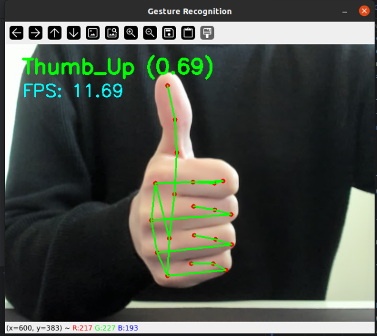

# Schnick Schack Schnick Pepper

## Schitt 0
- thema definieren
- api pepper anschauen
- ai vision modell finden (gesten)
- python pepper bibliothek

## Schritt 1 (prototyp)
- Kamera
- Pi mit Coral TPU
- Gestenerkennung der Hand
- Schnick Schack Schnuck business logik

## Schritt 2
- mit pepper zum laufen bekommen
- compute immer noch auf pi & coral tpu
- pepper kameras nutzen
- pepper und pi via wifi verbinden

## Todo



- [x] gesture recognition
- [ ] other/custom model for rock, paper, scissors
- [ ] game logic
- [ ] video stream
- [ ] tflight models

## Venv

```shell
python3.10 -m venv .venv
source .venv/bin/activate
pip install --upgrade pip
pip install -r requirements.txt
pip install git+https://github.com/google/mediapipe@master#subdirectory=mediapipe_model_maker
```

## Prerequisites
- install python 3.10

https://coral.ai/docs/edgetpu/compiler/

https://coral.ai/docs/accelerator/get-started/#install-the-edge-tpu-runtime

## Install edge tpu repo

```shell
echo "deb https://packages.cloud.google.com/apt coral-edgetpu-stable main" | sudo tee /etc/apt/sources.list.d/coral-edgetpu.list
curl https://packages.cloud.google.com/apt/doc/apt-key.gpg | sudo apt-key add -
sudo apt update
sudo apt install edgetpu-compiler
```

## Make own Model

```shell
unzip assets/rps_data_sample.zip 
python3 train_model.py
```
